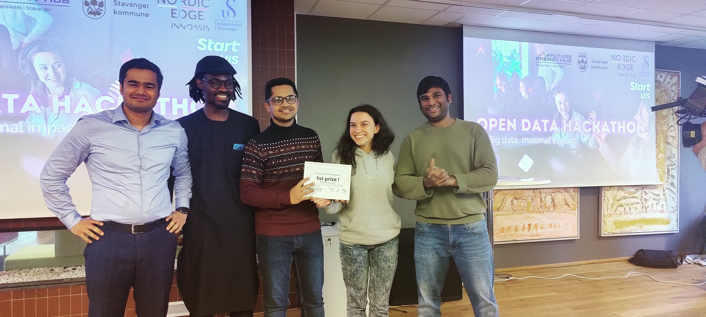
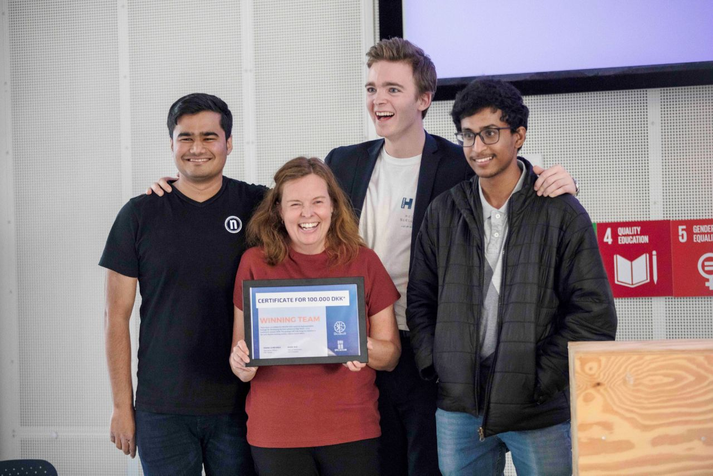
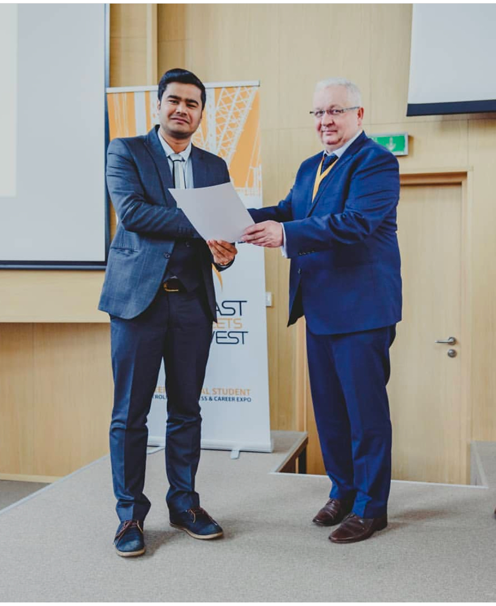
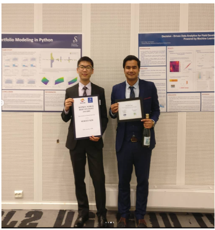

:::{.column-page}

<!-- # Awards & Recognition {.gradient-text .text-center .mb-5} -->

## Open Data Hackathon Prize {.award-heading}
**September 2022 | Stavanger Kommune**

{.award-image}

Awarded the prize of NOK 5,000 by Stavanger kommune for proposing an innovative data-driven application concept that addresses real-world challenges in urban development and city services.

## Innovation Hackathon Prize {.award-heading}
**September 2019 | Technical University of Denmark**

{.award-image}

Secured First Prize of DKK 100,000 at Technical University of Denmark for developing an innovative digital dialogue tool that revolutionizes communication for new parents. The project was selected among 50+ international teams.

## Best Poster Award {.award-heading}
**May 2019 | SPE European Region Contest**

{.award-image}

Received the Best Poster Award at the Society Of Petroleum Engineers European Region Contest in Krakow, Poland. The research presentation was recognized among international submissions for its innovative approach.

## Most Integrated International Student {.award-heading}
**June 2019 | University of Stavanger**

{.award-image}

Selected as the "Most Integrated International Student" at the Institute of Energy Resources, University of Stavanger. Recognition for exceptional academic performance and active participation in the university community.

:::

 