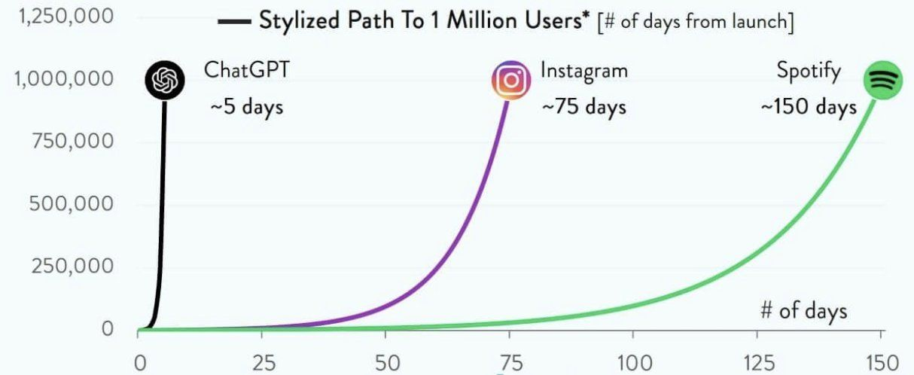

Generative AI, as it is defined today, represents the latest form of artificial intelligence. It has emerged in recent years and taken the world by storm. I would argue that the most important distinction between this wave of AI (GenAI) and previous ones is its widespread impact. This time, the technology is affecting a much larger audience. Just think about it—generative AI has reached people from all walks of life. My parents, who come from a third-world country, have heard of it, and it has become a part of conversations everywhere.

Looking at the chart below, which shows the number of days it took different technologies to reach 1M users. 

{width=80% fig-alt="Chart showing number of days different platforms took to reach 1M users"}

Source: [Image ](https://media.licdn.com/dms/image/v2/C4D22AQEFj5jyqdk2SQ/feedshare-shrink_800/feedshare-shrink_800/0/1672911218958?e=2147483647&v=beta&t=U1fEEok2QDrMsIgUyAOKjwaM7wjgJFd-5qUtXyQ3JGs)

This technology is fundamentally built upon the collective knowledge of humanity. Generative AI has been trained on almost all the knowledge we humans have shared through the Internet. Through the combination of this enormous data, compute power (hundreds of GPUs), and smart algorithms (transformers architecture), we humans have been able to build a tool that is changing the future of our world.

From a broad perspective, generative AI has undoubtedly influenced many lives. However, contrary to some fears, its purpose is not to replace humans or pose a threat. Like any technology, its goal should be to improve human lives. Think about 100 years ago—traveling from one country to another on horseback may have taken days, wasting time and resources. Then, airplanes revolutionized travel, making it efficient and even more enjoyable. Similarly, before the Internet, staying in touch with family required long trips, but now we can just reach out via video calls. Technology, when used correctly, should have a net positive effect on people's lives.

## How Can Generative AI Enhance Human Life?

Given this perspective, I believe an important question is: In what ways can generative AI enhance human life? This is where I want to focus—how generative AI can improve our lives. I will structure this discussion into four key areas, each supported by some anecdotal examples from my personal life, the four areas are:

- **Automating Boring Knowledge Work**
- **Enabling Tasks That Humans Cannot Do**
- **Acting as a Personal Advisor or Coach**
- **Helping Us with Better Decision-Making**


```{mermaid}
graph TD
    A[Ways Generative AI Can<br/>Enhance Human Life] --> B[Automating Boring<br/>Knowledge Work]
    A --> C[Enabling Tasks That<br/>Humans Can Not Do]
    A --> D[Acting as a Personal<br/>Advisor or Coach]
    A --> E[Helping Us with<br/>Better Decision-Making]
    
    classDef default fill:#f4f4f4,stroke:#333,stroke-width:2px;
    classDef root fill:#e1f5fe,stroke:#01579b,stroke-width:2px;
    
    class A root;
    class B,C,D,E default;
    
    linkStyle default stroke:#666,stroke-width:2px;
```

I will start with the first one.

### 1. Automating Boring Knowledge Work

One of the primary benefits of generative AI is automating repetitive (boring!) tasks, particularly those performed by knowledge workers. Ideally, the work we do from 9 to 3 (or 9 to 5 depending on your country :)) should be meaningful (at least we should strive for that!). Everyone deserves, or at least needs to try to find, meaningful work. Some people argue that they prefer simple, repetitive tasks without creativity, but I believe this often means they have yet to find something they truly enjoy.

I have yet to see one person say that she genuinely enjoy reading data from PDFs, punching it into Excel, and submitting reports to their manager (and doing this every day for, say, 5 years). Or manually reading invoices, extracting details, and compiling summaries? These tasks are soul-crushing :) because they lack creativity and could be done by anyone. The key idea here is to identify repetitive, unfulfilling tasks in the workplace and automate them so employees can focus on more impactful work.

Consider a scenario where an employee needs to fill out standard forms for a reporting purpose to an auditing company. Instead of manually completing each form, AI could generate a pre-filled template based on provided instructions, saving time and effort. The AI tool can draft about 80% of the form, then the employee needs to do the final review, double-check, and submit it. This way, employees can dedicate their energy to tasks that are more impactful.

### 2. Enabling Tasks That Humans Cannot Do

Another area where generative AI can be useful is when the task is too time-consuming for humans to do. Here, humans simply **cannot do the task**. Take, for example, a finance officer who wants to analyze 1,000 paper invoices received each month. Parsing and reading through each manually is nearly impossible, no matter how many employees are assigned to the task. However, generative AI can process the invoices, extract relevant data, and generate insightful reports, helping organizations make better decisions.

This category isn't about replacing human efforts; it's about enabling tasks that would otherwise be impossible for humans.

### 3. Acting as a Personal Advisor or Coach

We all need someone to brainstorm ideas with, and generative AI can serve as an excellent brainstorming tool. Some people prefer writing their thoughts on paper, but others may struggle with that process. Generative AI provides a way to facilitate brainstorming and ideation in an interactive manner.

For example, in my personal life, I often wake up wanting to exercise. I have two workout tools at home—a pull-up bar and an extra chest weight. I could ask ChatGPT (or Claude, etc.) to suggest a quick 30-minute workout (with the two tools I have at home) that helps me build an athletic physique (V shape is my favorite :)). Before AI, I would have had to search for routines manually. Now, AI can instantly generate a structured plan based on my preferences.

Another example is language learning. When I receive messages in Norwegian from my friends, sometimes understanding the cultural context of the message is more important than the message itself. When I pass it to an LLM, it can analyze the message and provide explanations, enabling me to reply with better understanding. This ability to act as an advisor or coach is invaluable.

### 4. Helping Us with Better Decision-Making

Now we come to the decision-making part, which has a special place in my heart :). I spent much of my PhD education on the science of making decisions, which is called "Decision Science"—it's like an ocean. The more I know about it, the more I realize how little I know about it.

Decision-making is another area where GenAI can be a powerful tool. I've found there are two ways GenAI can help people make better decisions:

1. GenAI can help people identify a more complete list of objectives they want to achieve  
2. Given the better list of objectives in (1), GenAI can help people generate more "creative" alternatives

Let's start with the first one.

### 4.1. Helping Us to Identify More Complete List of Objectives

Fundamentally, whenever we make a decision in our life, that decision should have an objective to achieve. It's very important we make decisions to achieve the things we want, and more importantly, we need to know what we want - because how can you "proactively" think about achieving what you want without knowing what you want? This brings us defining our objectives and values (things we care about).

[Research](https://pubsonline.informs.org/doi/epdf/10.1287/mnsc.1070.0754){target="_blank"} shows that when people are asked about what objectives they want to achieve, they often miss half of the things that are important to them ([Paper Link](https://www.researchgate.net/publication/220534710_Generating_Objectives_Can_Decision_Makers_Articulate_What_They_Want){target="_blank"}). Let me give you an example: if you ask a young person graduating from university who is looking for an internship about what they want to get out of this internship, they may say "I want to work with a company that's 1) close to my hometown, and 2) it should have good branding that leads to a secure job afterwards". These are their two initial objectives. But if you then ask them How about learning opportunities? Do not you want to prioritize learning opportunities when evaluating the alternatives? How about having a good boss who helps you gain valuable experience?" they'll likely respond "Of course those are important, I just forgot to list them!".

Even in my personal experience, when I list the objectives I want to achieve, I often miss some important points. So here I use a ChatGPT other generative AI tools to help me out. So I write in the tools that "I'm making this particular decision and these are the objective I'm considering to evaluate my alternative. What objectives do you think I am missing?". And always, always I see some items that are, of course, important, which I had forgotten to list. My point here is that we humans are not very good at articulating the value and objective we have in our heads. So it's like something that's hidden in our brain that you need to uncover through scratching, brainstorming, or talking it through to bring those deeper level objectives and values to the surface.


### 4.2. Helping Us to Generate More "Creative" Alternatives

Another thing that I find very useful is that once you have your list of objectives - for example, when deciding to buy a house or a car - you can give these objectives to ChatGPT to help generate *creative* alternatives. Sometimes it comes up with creative new options that we can then evaluate as humans. This is particularly useful because one limitation we humans have is that we tend to generate very few alternatives on our own.

I often use this this prompt "Given these my personal values in this decision, what alternative would you suggest that would achieve my values?". There will be some back-and-forth dialogue, but overall, it's a great tool to help you achieve what you want.

## Conclusion

I believe generative AI presents an enormous opportunity. I'm optimistic about its potential because of its vast capabilities. However, like any technology, it comes with challenges. For instance, the non-deterministic nature of large language models means that even small input changes can produce vastly different outputs. Hallucinations—instances where AI generates misleading or incorrect information—are another concern. Additionally, AI-generated content often lack a human touch (honestly, I hate reading AI-generated content). Furthermore, there are many cases where we perhaps should not use GenAI. Chip Huyen has written a great post on this topic [here](https://huyenchip.com/2025/01/16/ai-engineering-pitfalls.html){target="_blank"}.

Despite these challenges, I believe the net effect of GenAI for society is positive. If used responsibly and if we educate people, especially younger generations, on how to use it effectively, this technology has the potential to bring significant benefits to society.


