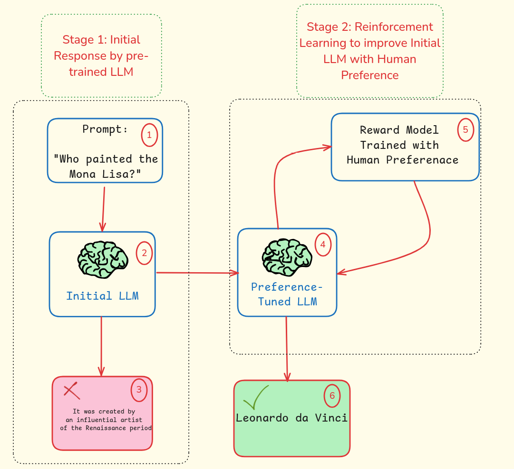
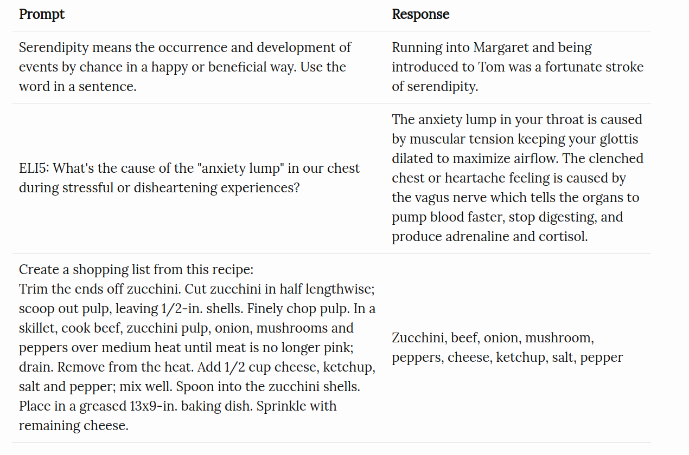

## Introduction 

So this blog post is for the people who are who probably heard the term Reinforcement Learning from Human Feedback (RLHF) and are curious what is this methodology is and what are the resources to learn about it. 

Essentially, RLHF has been developed to transform Large Language Models (LLM) from *AI model* to *AI assistant*. That is the core idea. The AI assistant here means that Foundation model companies like OpenAI, Claude, Google can make AI products that are more helpful and useful for their costumers. Indeed that is a crucial aspect of the any product development strategy because ultimately, you want to build products that are useful for your human customers.  

## Background on Foundation Models

Now Let's see how modern AI assistants like ChatGPT, Claude, or other Large Language Models (LLMs) are developed. The training process of these models typically involves three phases:

### Phase 1: Pre-training

In this initial phase, the model learns from vast amounts of internet data (typically trillions of tokens) to predict the next word in a sequence. Think of it as learning the statistical patterns of language. For example, if given the phrase "my favorite football team in UK is ___", the model learns that "Manchester United" or "Chelsea" are more likely completions (higher probability) than "car" or "pizza". 
This phase helps the model to develop a basic understanding of language structure and meaning. To get intuition about how to assign probability of next word, I encourage you to go and play with Transformer Explainer website [here](https://transformer.huggingface.co/). You add sentence at top, and on far right side you cna see the probability of next word.

### Phase 2: Supervised Fine-tuning (SFT)

Language is inherently flexible - there are many valid ways to respond to any prompt. For example, if asked "How do I make pasta?", valid responses could include listing ingredients, explaining cooking steps, or suggesting serving sizes. During supervised fine-tuning, we provide the model with examples of good question-answer - These pairs is to help model learn appropriate response patterns. The data used in this phase is typically collected from highly-educated workers. They are high-quality data. Here are some 
examples of supervised fine-tuning datasets:

### Phase 3: Reinforcement Learning from Human Feedback (RLHF)

Even after phase 2, some responses are better than others from a human perspective. In 
Phase 3 we show the model's various responses, and ask human to rate them. Essentially, we would like to optimize teh model for teh output that get higher ratings from humans. 
This stage that bring human feedback into the loop is called Reinforcement Learning from Human Feedback (RLHF).

Now with this background, let's see how we can learn about RLHF.

## Study Roadmap

To help you navigate this complex topic, I've organized learning resources into five main categories:

1. **Introductory Tutorials**
2. **Key Research Papers**
3. **Hands-on Codes**
4. **Online Courses**
5. **RLHF Book**

### Introductory Tutorials

Here the goal is to get a high-level understanding of RLHF. I suggest you to start with the Chip Huyen's blog post on RLHF. It is a great introduction to the topic.

Resources:

1. 📚 20m: *Introduction to RLHF* by Chip Huyen [Read here](https://t.ly/kt7vZ)
2. 📺 40m: *RLHF: From Zero to ChatGPT* by Nathan Lambert [Watch here](https://t.ly/gOj_-)
3. 📺 60m: *Lecture on RLHF* by Hyung Won Chung [See here](https://t.ly/S4LWN)

### Key Research Papers

Here are some important research papers I think worth reading to get a deeper understanding of RLHF.

- 📚 30m: *InstructGPT Paper* – Applying RLHF to a general language model [Read here](https://t.ly/iBARr)
- 📚 30m: *DPO Paper* by Rafael Rafailov [Read here](https://arxiv.org/pdf/2305.18290)
- 📚 30m: *Artificial Intelligence, Values, and Alignment* – An essential paper [Read here](https://t.ly/DLxNM)

### Hands-on Codes

Here I am adding some codes that you can run on your local machine to get a hands-on experience of RLHF. I woudl like to note that TRL seems a nice library that has been used for RLHF, maybe that can be go to go for you when it comes to RLHF implementation. 

- 📚 2h: *Detoxifying a Language Model using PPO* [Read here](https://shorturl.at/o2X31)
- 📚 2h: *RLHF with DPO & Hugging Face* [Read here](https://shorturl.at/q1Brq)
- 📚 1h: *TRL Library for Fast Implementation* – Minimal and efficient [Read here](https://shorturl.at/ezzvU)

### Online Courses

If you are looking for a more structured learning experience, I recommend taking an online course. Here are some courses that cover RLHF:

- 📚 1h: *Reinforcement Learning from Human Feedback* by Nikita Namjoshi [Course link](https://www.deeplearning.ai/short-courses/reinforcement-learning-from-human-feedback/)

### RLHF Book

Finally, if you want to dive deep into RLHF, I recommend reading the book [*A Little Bit of Reinforcement Learning from Human Feedback](https://rlhfbook.com/book.pdf) by Nathan Lambert. This book is in progress and you can read it online for free.

## Conclusion

I hope this study guide helps you get started with Reinforcement Learning from Human Feedback (RLHF). Remember, the key to mastering any topic is consistent practice and learning. Good luck on your RLHF journey!