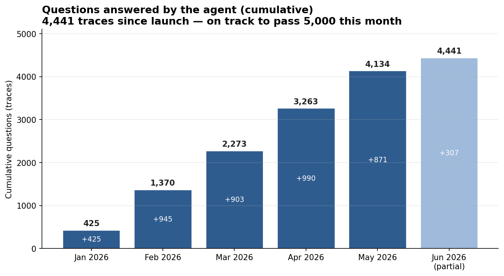
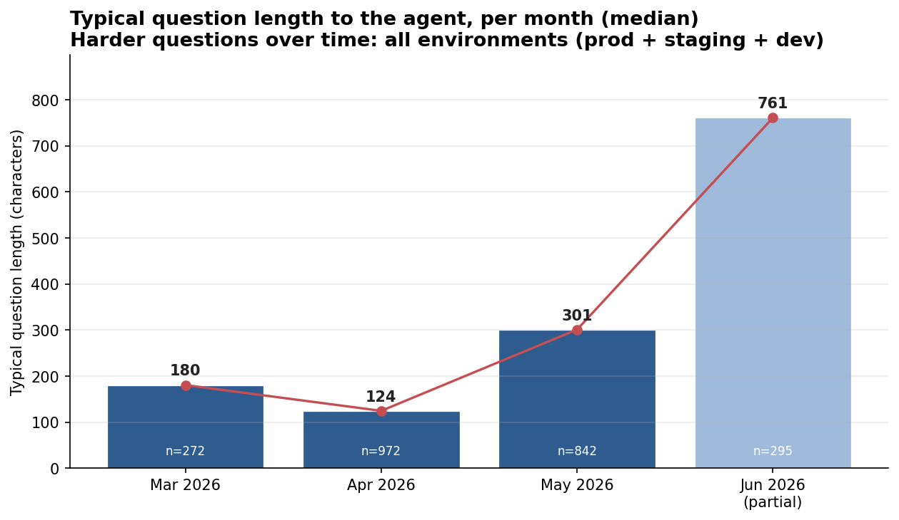

For the past year, I was building a AI Agent and puting it in production: a custom
agent for a small business, built to help its employees with the analytical work
they do every day. This is not a chatbot demo and not a horizontal product. It is
one agent, cover whole organization, in production.

Five months after launch now it answers roughly 1,000 analytical questions a month,
and the number keeps climbing — on the order of 5,000 questions served so far.

{width=90%}

Working on this project taught me lessons I keep repeating to other engineers, so I am writing
them down. One caveat up front: building an AI agent inside an organization (the
B2B case — you are building one deep solution for one business, not a product for
a market) has no settled best practices yet. It is mostly engineering in a sense: 
trial and error until things work. The single biggest accelerant
I found is working closely with a subject-matter expert and building a
relationship tight enough to iterate fast. When that loop is short, the
probability of success rises sharply.

Below, I am listing 5 lessons that i wish I knew earlier when I started this project, and type of learnings 
that I will be keeping in my mind for future projects.

## TL;DR

1. **Work backward from the answer.** Start from the questions and ideal answers
   your experts want, then build toward them.
2. **Observability is what takes you from 1 to N.** You cannot scale what you
   cannot see.
3. **Shrink the loop between idea and product.** Iteration speed is the whole game.
4. **The better the agent gets, the harder the questions become.** Plan for it.
5. **A prompt is a semi-product.** Encoding expert workflows is the competitive
   advantage — and the moat.

## 1) Work backward from the answer you want

This is where I would start any agent project. Do not begin with the model or the
architecture. Begin with the questions.

Collect five or ten questions that people in the organization actually ask —
analytical or insight questions that take real time and that they would genuinely
value handing of them to AI agent. Note that this was case when I started the project last year. However, this year,
with all progress made in agentic AI, you can replace questiosn with workflow, or any long horizon task,
that you belive AI-agent can do that.

 Then build a simple three-column table:

| The question | The context needed to answer it | The ideal answer |
|---|---|---|
| A real question someone in the organization asked | The specific data, external knowledge, or internal documents required to answer it well | What a complete, correct answer looks like ,  defined by your expert |

The first column is the demand. The second column is the hard part: the specific
data, the external knowledge, the internal PDFs — every source needed to produce a
correct answer. The third column, written by your client or expert, is the target.

Starting from the answer would force clarity to AI-enginners about what the agent is actually for. Once
the target exists, you can work backward to the context, get a first response from
the model, and iterate against a known goal.

The whole lesson fits in one line:

$$
\text{Ideal Answer} \;=\; \operatorname{Agent}(\text{Question},\; \text{Context})
$$

Most teams read this left to right: take a question, throw context at the agent, and
hope the answer is good. Work backward instead — start from the ideal answer your
expert defined, hold the question fixed, and figure out the context that gets you
there.

## 2) Observability is what takes you from 1 to N

You can get from zero to one by talking to your client and your subject-matter
expert. Getting from one to N — scaling — requires that you see, for every
interaction, what was asked, what the agent answered, which tools it called, and
how it arrived at the result.

Observability is not only monitoring. It is also a great tool to help you iterate faster. 
As soon as I had a view into the questions and the agent's
responses, every subsequent iteration got easier: I could see what was being
asked, what context each class of question needed, and where the agent fell short.
The trace log is also the best idea generator you have — it tells you what to build
next.

## 3) Shrink the loop between idea and product

As an engineer, your first job on an agent project is to reduce the time between
having an idea and putting it in front of a user. Set things up so you can get
feedback from your subject-matter expert quickly and ship the change immediately.
This is product development, and the variable that matters most is iteration speed.

It works best with small teams on both sides: one or two full-stack engineers and
one or two domain experts, iterating together. The shorter the team, the shorter
the loop.

In practice, I built tooling so that my Slack conversations with the client feed
directly into the agent's development — the feedback channel and the build channel
are the same channel. The question I keep asking is simply: how do I make this loop
faster?

## 4) The better the agent gets, the harder the questions become

Expect the questions to get harder over time. I was consistently surprised by how
much more demanding users became — they kept reaching for longer-horizon tasks.

There are two reasons. First, once the easy questions are reliably answered, users
push for the hard ones; that is where the remaining value is. Second, as model
capability improves, genuinely long-horizon tasks — ones that take the agent 30 to
40 minutes to work through — become feasible, so users ask for them. Plan for this
from the start: the demand curve shifts toward difficulty, not away from it.

This is measurable. Tracking the length of incoming questions in LangSmith is a
cheap proxy for difficulty, and it climbs as users move to longer-horizon work.

{width=90%}

## 5) A prompt is a semi-product

This is where the moat lives. The obvious objection to building a custom agent is:
why bother, when Copilot, Claude Code, and other general tools exist? The answer is
that businesses hold two things those tools cannot reach — internal knowledge, and
specific prompts.

I think of a prompt as a semi-product. A good prompt encodes a long, particular
workflow that one senior person in the business knows and others do not. Converting
those prompts into skills the agent can execute is what turns a generic assistant
into a custom solution — and into a competitive advantage that a general-purpose
tool cannot replicate, because it never had access to that workflow.

The flexibility is the point: you control not just the context the agent receives,
but how it works and how its interface is shaped, so it fits the business exactly.

That fit is the differentiator. My view, stated plainly: every company should have
its own agent, customized to its workflows — because that customization is the only
durable advantage. The model is a commodity. The captured workflow is not.

