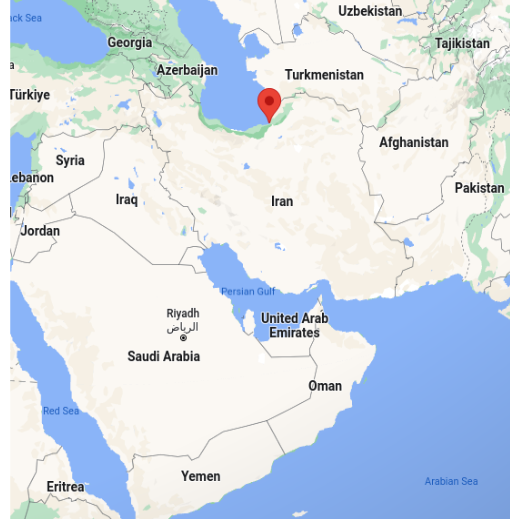
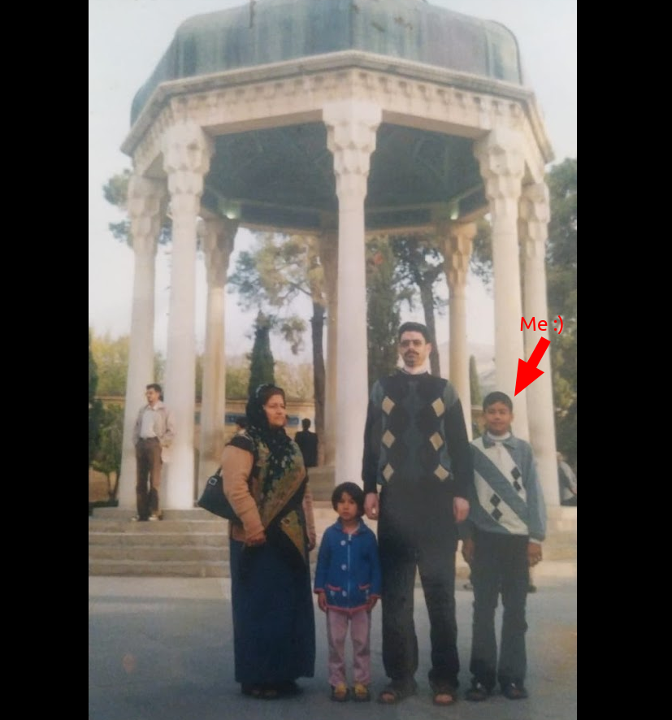
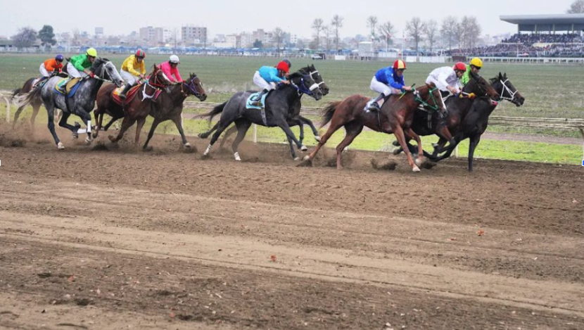
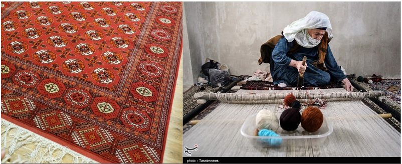
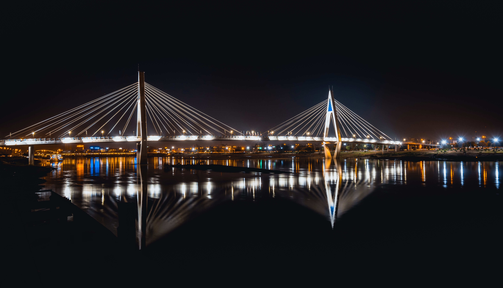
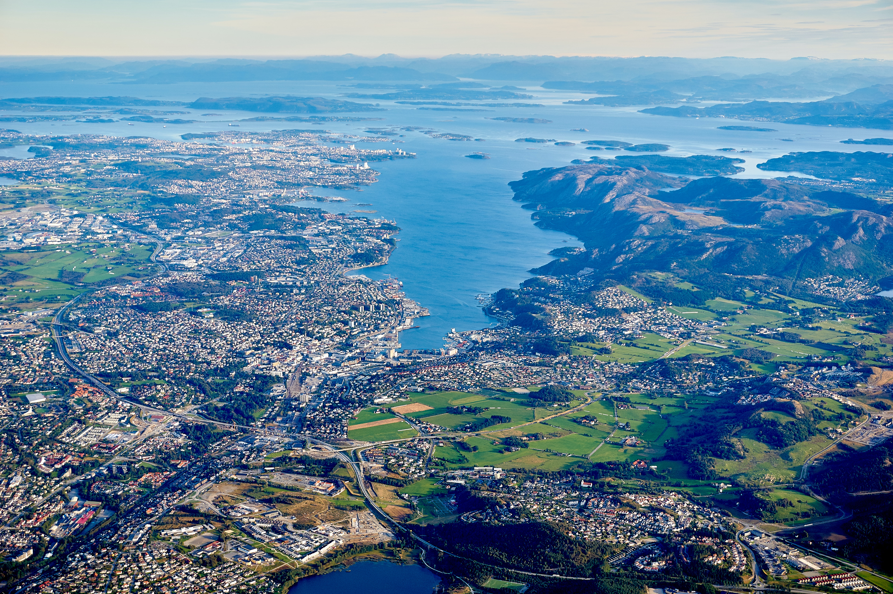
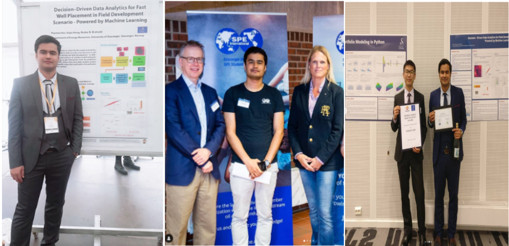

# Hometown and Family, Bandar Torkaman, Iran

I come from Iran, specifically the northern part of Iran, Golestan province. My place of birth is the city of [Bandar Torkaman](https://en.wikipedia.org/wiki/Bandar_Torkaman)), known for its predominantly Turkmen population.

 

  

 

I grew up in a family where both of my parents were teachers. My cultural heritage is [Turkmen](https://en.wikipedia.org/wiki/Turkmens), and I completed all my pre-university schooling right there in my hometown.

 

  

 

Bandare Torkman is famous for two remarkable attributes. Firstly, it hosts an annual horse racing competition, an event I eagerly attended year after year.

 

  

 

Additionally, my hometown is celebrated for producing some of the finest handmade carpets globally, recognized as [Turkmen carpets](https://en.wikipedia.org/wiki/Turkmen_rug).

 

  

 

# Education

## B.Sc in Engineering (2011-2016) - Ahwaz, Iran

Coming from north of Iran, I flew to the south of Iran to do my B.Sc studey in Petroleum Enginnering at Petroluem University of Technology.

I spend 4 years in beatiful city of [Ahvaz](https://en.wikipedia.org/wiki/Ahvaz).

 

  
  
Ahvaz City - Photo by <a href="https://unsplash.com/@ashkfor121?utm_content=creditCopyText&utm_medium=referral&utm_source=unsplash">Ashkan Forouzani</a> on <a href="https://unsplash.com/photos/body-of-water-under-bridge-near-city-at-night-rvFaGeJ4JMI?utm_content=creditCopyText&utm_medium=referral&utm_source=unsplash">Unsplash</a>
   

 

## M.Sc in Engineering (2017-2019) - Stavanger, Norway

Then, I decided to do my M.Sc in outside of my conuty. I apllied for M.Sc program for couples of places in the world (USA, UK, Italy,...) and Norway and I had admission from couples of difrenet university.

I picked Norway and Stavanger as I heared it is oil city nd country and that fits very well to my B.Sc Education.

 

  
  
Stavanger City - Photo by <a href="https://unsplash.com/@megapixel_world?utm_content=creditCopyText&utm_medium=referral&utm_source=unsplash">Oleksii T</a> on <a href="https://unsplash.com/photos/aerial-view-of-seashore-YTZ2SYW_-fQ?utm_content=creditCopyText&utm_medium=referral&utm_source=unsplash">Unsplash</a>
  
   

 

I enjoued my M.Sc study at Stavanger, and it was combination a lot of fresh experincin of living new country as well professional developmne for myself.

 

  
  
A few snapshots from my days during my MSc program in Stavanger
  
   

 

## M.Sc Study in Applied Math (2017-2019) - Copenhagen, Denmark
