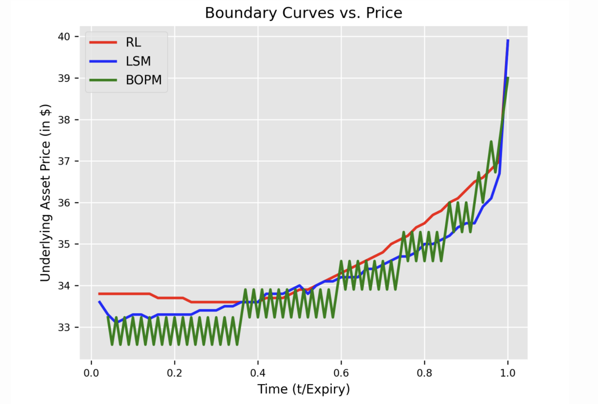
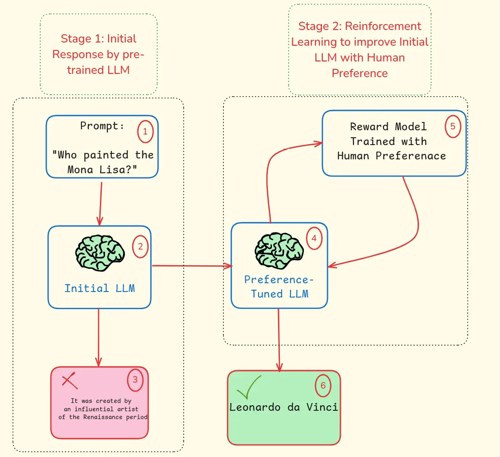
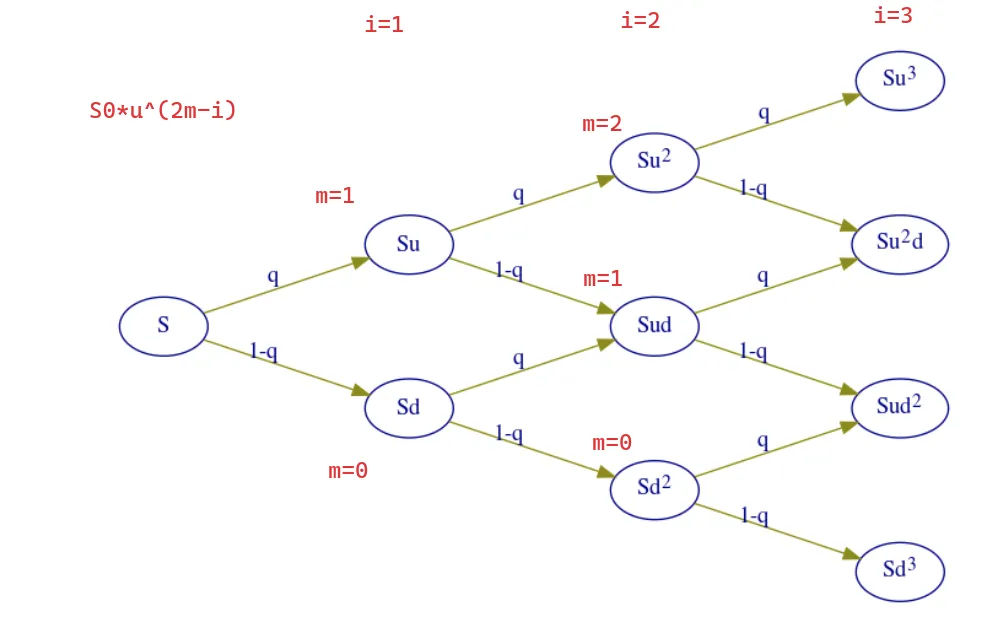
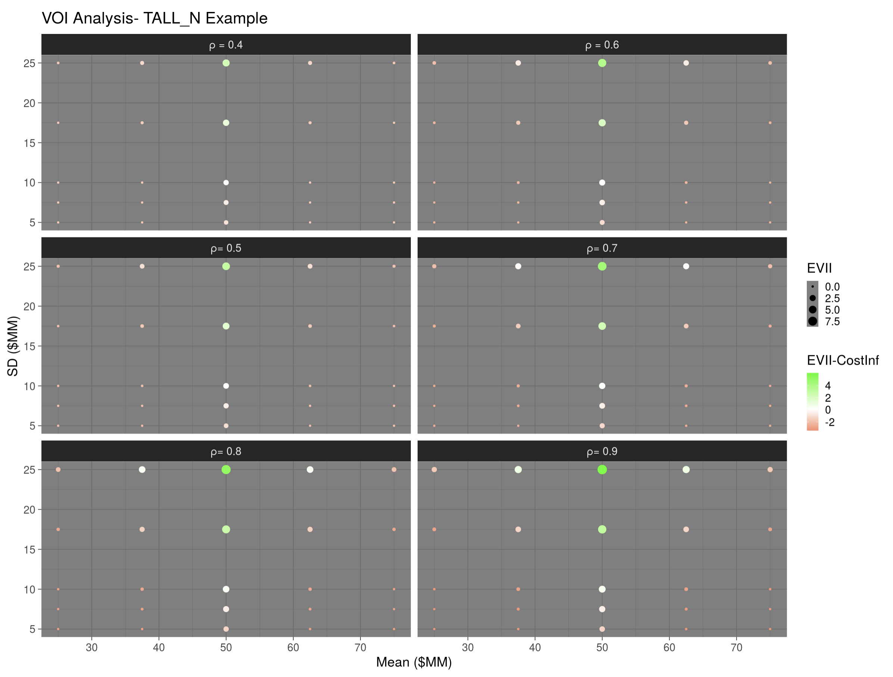
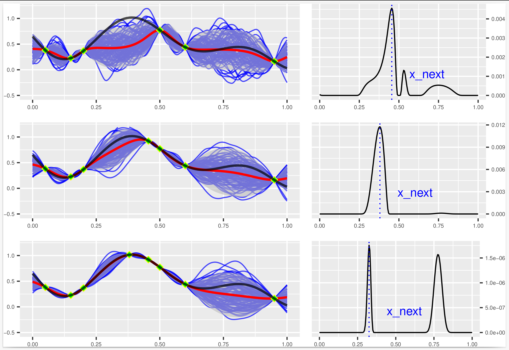
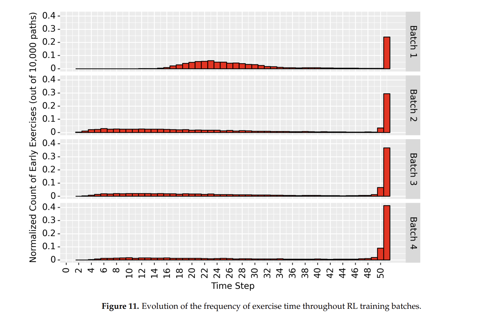

## Data Science & AI Projects

Here you'll find a collection of my work in machine learning, reinforcement learning, optimization, and decision analytics. 

Mainly written in **Python/R** programming languages, and often under version control with **Git/GitHub**.    

### Featured Projects

#### Ameriopt Python package for American Option Pricing with Reinforcement Learning

{width=800 height=600}

**GitHub**: [Repository](https://github.com/Peymankor/AmeriOpt)  
**Article**: [Online](https://www.mdpi.com/1999-4893/17/9/400)

Here I developed a Python package for American option pricing using reinforcement learning. It is available on [PyPI](https://pypi.org/project/ameriopt/) and [GitHub](https://github.com/Peymankor/AmeriOpt). Is a simple and efficient way to price American options using reinforcement learning.

::: {.skills}

:::

---

#### Inventory Optimization with Reinforcement Learning

{width=400 height=600}

**GitHub**: [Repository](https://github.com/Peymankor/medium_blogs/blob/main/2024/08-Aug/RL-Inventory/main.py)  
**Article**: [Medium](https://medium.com/towards-data-science/optimizing-inventory-management-with-reinforcement-learning-a-hands-on-python-guide-7833df3d25a6)

Developed a reinforcement learning approach to optimize inventory management decisions. I implemented Q-Learning algorithm in Python to determine optimal ordering policies that minimize costs while maintaining service levels.

::: {.skills}

:::

---

#### Dynamic Programming for Inventory Optimization

{width=800 height=600}
 
**Article**: [TowardsAI](https://pub.towardsai.net/inventory-optimization-with-dynamic-programming-in-less-than-100-lines-of-python-code-ab1cc58ef34c)

Implemented a dynamic programming solution for inventory management in less than 100 lines of Python code. The approach determines optimal inventory levels by balancing holding costs, stockout costs, and ordering costs.

::: {.skills}

:::

---

#### Reinforcement Learning for LLM Alignment

{width=800 height=600}

**GitHub**: [Repository](https://github.com/Peymankor/RLHF)  
**Article**: [AIMind](https://pub.aimind.so/reinforcement-learning-meets-large-language-models-llms-aligning-human-preferences-in-llms-88c3a3f1a3f9)

Here, I explored the application of Reinforcement Learning from Human Feedback (RLHF) for aligning Large Language Models with human preferences.

::: {.skills}

:::

---

#### Binomial Option Pricing Model

{width=800 height=600}

**Article**: [DataDrivenInvestor](https://medium.datadriveninvestor.com/from-zero-to-hero-a-step-by-step-guide-to-binomial-option-pricing-in-less-than-30-lines-of-code-10ff2af268e2)

Implemented a Python implementation of the Binomial Option Pricing Model for valuing American options. The implementation uses recursive techniques to efficiently calculate option prices at different time steps.

::: {.skills}

:::

---

#### Probabilistic Reserve Estimate Dashboard (AKER BP)

{width=900 height=800}

**Demo**: [VOI Analysis](https://peymankor.shinyapps.io/VOI_Analysis/) | [Probabilistic Reserve Evaluation](https://peymankor.shinyapps.io/Probabilistc_Reserve_Evaluation_V1/)

Here, I developed a probabilistic reserve estimate dashboard tool using R Shiny/RStudio during my project with AKER BP (ShinyApps). The tool provides real-time data-driven insights for decision-making in energy asset valuation. It also allows users to analyze over 10,000 scenarios using Monte Carlo simulations, enabling improved risk assessment and data-driven decision-making.

::: {.skills}

:::

### Research & Academic Projects

#### Bayesian Optimization for Reservoir Engineering

{width=800 height=600}

**GitHub**: [Repository](https://github.com/Peymankor/BayesOpt_Reservoir_Optimization)

Applied Bayesian optimization techniques to optimize well placement and control in reservoir engineering. The approach efficiently explores the parameter space to maximize oil recovery while minimizing computational costs.

::: {.skills}

:::

#### Reinforcement Learning for American Option Pricing

{width=800 height=600}

**GitHub**: [Repository](https://github.com/Peymankor/RLHF)

Implemented a reinforcement learning approach to optimize American option pricing. The approach uses a deep neural network to approximate the optimal policy for pricing American options.

::: {.skills}

:::

---

### Data Science Articles & Tutorials

- [Bridging the Gap: Integrating Data Science and Decision Science through Six Essential Questions](https://pub.towardsai.net/bridging-the-gap-integrating-data-science-and-decision-science-through-six-essential-questions-1747eff7487d)
- [Learn Reinforcement Learning from Human Feedback (RLHF): Your 9-Hour Study Plan](https://pub.towardsai.net/learn-reinforcement-learning-from-human-feedback-rlhf-your-9-hour-study-plan-2bb0b8314e94)
- [Understanding Why There Is No Such Thing as 'Correct Probability' in Data Science](https://pub.towardsai.net/understanding-why-there-is-no-such-thing-as-correct-probability-in-data-science-950c81629bcf)
- [Forgot Solutions in Life. It's All About Trade-offs (Here Is How to Master Them)](https://medium.com/@peymankor/forgot-solutions-in-life-its-all-about-trade-offs-here-is-how-to-master-them-4cdbf3a8a395)
- [The Power of Negative Thinking: Supercharge your Decision-Making Skill](https://medium.com/@peymankor/the-power-of-negative-thinking-supercharge-your-decision-making-skill-c81782177f97)

